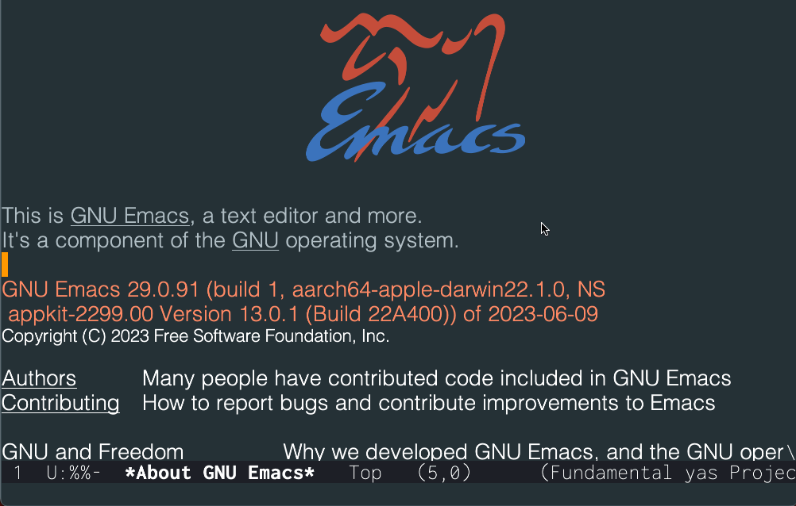

# aichat.el

_Chat with language models in Emacs._



## Features

* Everything is text! Kill and yank all over the chat buffer.
* Supports OpenAI, Claude, Replicate, Groq, Ollama
* Include context from other open buffers, files, and websites on the internet.
* Save and load chat sessions locally.
* Streaming text output.

## Setup

The following API keys must be set in the environment to be able to use cloud APIs:

* [Replicate](https://replicate.com/): `REPLICATE_API_KEY`
* [Claude](https://claude.ai/): `ANTHROPIC_API_KEY`
* [OpenAI](https://chatgpt.com/): `OPENAI_API_KEY`
* [Groq](https://groq.com/): `GROQ_API_KEY`

Ollama doesn't need any API keys since it's running locally.

You can use `(setenv <provider> <api-key>)` to set environment variables if they're not loaded automatically in Emacs.

## Usage

`M-x aichat` starts a new chat session.

A chat session looks like this:

``` markdown
## SYSTEM:

You are a helpful assistant.

## USER:

Write a haiku about Uddevalla.

## ASSISTANT:

Here is a haiku about Uddevalla:

Harbor town by sea,
Steep hills and ancient churches,
Uddevalla's charm.
```

Hit `M-<return>` to send the chat session to the AI model.

### Including files and websites in the prompt context

By using the magic `<ai-context>` tag, you can include any file on the file system or website on the internet in the prompt.

``` markdown
## USER:

<ai-context>https://bohuslansspelmansforbund.se/aktuellt/evenemang/</ai-context>

What's the next folk music event in Bohuslän?
```

### Key bindings

* `M-<return>` - Send the chat buffer to the AI and get an assistant response
* `C-; u` - Insert the string "USER:"
* `C-; s` - Insert the string "SYSTEM:"
* `C-; a` - Insert the string "ASSISTANT:"
* `C-; f` - Insert an `<ai-context>` tag with the name of a file on disk
* `C-; b` - Insert an `<ai-context>` tag with the filename of an open buffer
* `C-; h` - Insert an `<ai-context>` tag with a website URL
* `C-; m` - Change AI model
* `C-; c` - Copy the current code block (delimited by triple backticks)
* `C-g` - While text is being generated, use `C-g` to interrupt generation
